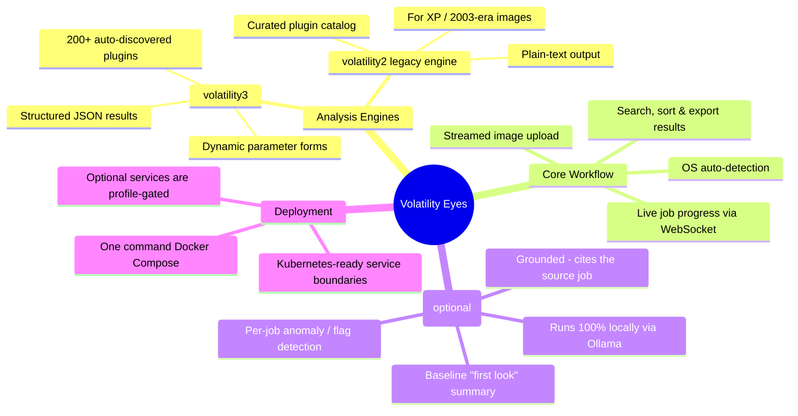
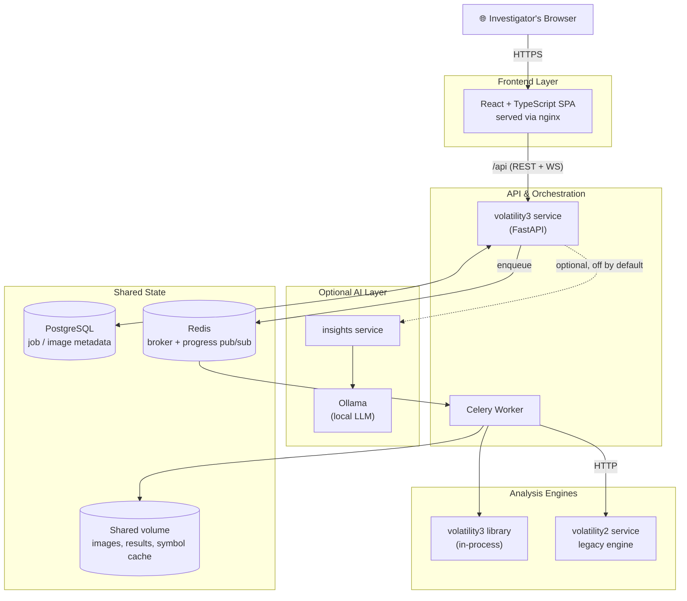
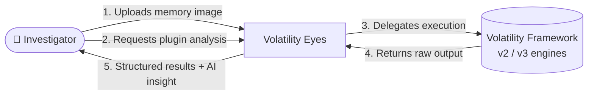
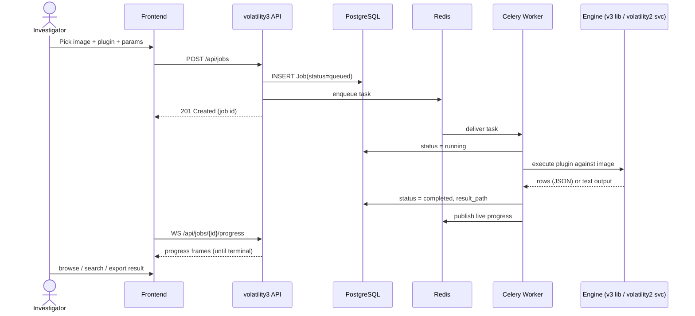
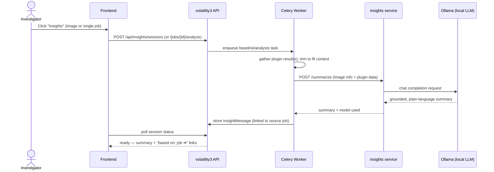

<div align="center">


# Volatility Eyes

**A lightweight, open-source, microservice-based web GUI for RAM forensics.**

Upload a memory image, click a plugin, get results — no terminal required.

[](LICENSE)
[](#-quick-start)
[](#-tech-stack)
[](#-tech-stack)
[](#-tech-stack)

[Overview](#-overview) • [Architecture](#-architecture) • [Microservices](#-microservices-at-a-glance) • [Quick Start](#-quick-start) • [Insights](#-optional-ai-insights)

</div>

---

## 📖 Overview

Memory forensics is powerful but has a steep entry cost: [volatility3](https://github.com/volatilityfoundation/volatility3) and its predecessor volatility2 are **CLI-only**, plugin output is raw text/JSON, and running dozens of plugins against a multi-GB memory image means juggling long-running terminal commands by hand.

**Volatility Eyes** wraps that workflow in a browser: upload an image, pick a plugin from a searchable catalog, watch live progress, and browse/search/export results in a table — all backed by a small set of independent, purpose-built microservices instead of one large monolith.

| Design goal | How it's achieved |
|---|---|
| 🧩 **Microservice-based** | Each concern (API, async execution, legacy engine, optional AI) is its own container with its own failure boundary |
| 🪶 **Lightweight** | Multi-stage Docker builds strip every image down to only what's needed at runtime (see [sizes](#-tech-stack)) |
| 🔓 **Open source** | MIT-licensed; runs entirely on your own machine, no cloud dependency, no telemetry |
| 🖥️ **GUI-first** | Every plugin gets a dynamically generated form from its own parameter schema — no CLI flags to memorize |

---

## 🗺️ Feature Map



---

## 🏗️ Architecture



> Every arrow is a real network/process boundary — a crash in `insights` or `volatility2` cannot take down `volatility3`'s core analysis path. See [Microservices at a Glance](#-microservices-at-a-glance) for what each box actually does.

---

## 🔄 How It Works — Data Flow

**Level-0 DFD** — the system as a black box:



**Level-1 DFD** — submitting and running a plugin job:



<details>
<summary><strong>🤖 Insights (AI analysis) flow</strong> — click to expand</summary>



Every AI-generated claim links back to the real job it came from, so nothing is presented without a way to independently verify it.

</details>

---

## 🧬 Microservices at a Glance

| # | Service | Role | Always On? | Talks To |
|---|---|---|:---:|---|
| 1 | **`volatility3`** | FastAPI REST + WebSocket API; owns all persistence (images, jobs, insight sessions) | ✅ | Postgres, Redis, `volatility2`, `insights` |
| 2 | **`worker`** | Celery worker — the only process that actually *executes* plugins (long-running, async) | ✅ | Postgres, Redis, shared volume, `volatility2`, `insights` |
| 3 | **`volatility2`** | Isolated legacy-engine microservice for images the v3 automagic can't parse (older Windows XP/2003 captures) | ✅ | Read-only shared volume |
| 4 | **`frontend`** | React SPA + nginx reverse proxy | ✅ | `volatility3` (via `/api`) |
| 5 | **`postgres`** | System of record — image/job/insight metadata | ✅ | — |
| 6 | **`redis`** | Job queue broker + live progress pub/sub | ✅ | — |
| 7 | **`insights`** | Stateless LLM-orchestration service (builds prompts, calls Ollama) | ⭘ optional | Ollama |
| 8 | **`ollama`** | Local LLM runtime (no data leaves the machine) | ⭘ optional | — |

**Isolation by design:** `volatility2` and `insights` each sit behind their own HTTP boundary with a "reachable = enabled" contract — if either is stopped, `volatility3`'s core upload/analyze workflow keeps working unaffected. This is enforced by having **separate code paths end-to-end** (own Celery tasks, own DB fields, own error handling), not a shared branch that could couple their failure modes.

---

## 🧰 Tech Stack

| Layer | Choice | Why |
|---|---|---|
| Frontend | React + TypeScript, Vite, plain CSS | Fast dev loop, no heavy UI framework overhead |
| Web server | nginx (Alpine) | Serves the SPA + reverse-proxies `/api` (incl. WebSocket upgrade) |
| API | FastAPI (Python 3.12) | Async, auto-generated OpenAPI docs, native multipart streaming |
| Async jobs | Celery + Redis | Long-running plugin execution never blocks the API |
| Database | PostgreSQL 16 + SQLAlchemy + Alembic | Durable metadata, versioned schema migrations |
| Legacy engine | Python 2.7 (isolated container) | The only way to run volatility2, contained entirely to its own service |
| AI (optional) | Ollama + `qwen2.5:3b-instruct` | 100% local inference — no data ever leaves the host |
| Orchestration | Docker Compose | Single-host now; stateless services + externalized state = Kubernetes-ready later |

**Every image is intentionally slim** (multi-stage builds strip compilers, test suites, and unused package internals):

| Image | Size |
|---|---:|
| `frontend` | ~48 MB |
| `volatility2` | ~162 MB |
| `insights` | ~168 MB |
| `volatility3` / `worker` | ~244 MB |

---

## 🚀 Quick Start

**Prerequisite:** [Docker Desktop](https://www.docker.com/products/docker-desktop/) (nothing else — no local Python/Node install needed).

```bash
git clone <your-repository-url>
cd volatility-eyes

docker compose up -d --build
```

That's it. Open **http://localhost:3000**.

This brings up 6 containers: `postgres`, `redis`, `volatility3`, `worker`, `frontend`, `volatility2`. To stop everything:

```bash
docker compose down            # keep data
docker compose down -v         # also wipe Postgres/upload/symbol-cache volumes
```

<details>
<summary><strong>First-run note</strong> — why the first plugin run can take a minute</summary>

The first analysis run against a given OS/kernel version has to download and convert its PDB/symbol table (~30–90s, sometimes longer for symbol-heavy plugins). This is cached in a persistent volume, so every subsequent run — even after a container restart — is fast.

</details>

---

## 🤖 Optional: AI Insights

Off by default — zero cost, zero footprint, until you explicitly enable it:

```bash
docker compose --profile insights up -d --build
docker compose exec ollama ollama pull qwen2.5:3b-instruct   # first time only
```

This adds `ollama` + `insights` and unlocks two AI-assisted workflows in the UI:

- **Baseline summary** — click "Insights" on any image for a plain-language "first look" across a fixed triage plugin bundle (works for both the volatility3 *and* volatility2 legacy engine, whichever actually works for that image).
- **Per-job analysis** — click "Insights" beside "Export" on any completed job's result page for a focused anomaly/"flag point" read of just that plugin's output.

Every summary is **grounded**: it only reasons over data you can also see, and cites the specific job(s) it's based on. Disable again anytime with `docker compose stop ollama insights` — nothing else in the stack notices or breaks.

---

## 🗂️ Project Structure

```
volatility-eyes/
├── volatility3/          # FastAPI + Celery service — API, job orchestration, persistence
│   ├── app/
│   │   ├── vol_service/  # volatility3 library wrapper (discovery, schema, execution)
│   │   ├── api/          # REST + WebSocket routes
│   │   ├── worker/       # Celery tasks (v3 execution, legacy delegation, insights)
│   │   └── insights/     # baseline plugin bundles + context-trimming
│   └── alembic/          # versioned DB schema migrations
├── volatility2/          # Isolated legacy-engine microservice (Python 2.7, curated plugins)
├── frontend/              # React + TypeScript SPA
├── insights/              # Optional stateless LLM-orchestration service
├── docker-compose.yml
├── LICENSE
└── README.md
```

---

## 🕰️ Using the volatility2 Legacy Engine

Some memory images — mainly older Windows (XP/2003-era) captures — defeat volatility3's automagic symbol resolution entirely. volatility2's static profile system handles these natively. To use it:

1. On the **Images** page, click **detect** in the *Legacy Profile* column.
2. On **Run a Plugin**, switch **Engine** to `volatility2`.

Results render as searchable plain text (volatility2 has no structured output format), with the same export-as-text support as volatility3 results.

---

<details>
<summary><strong>🛠️ Local Development (without Docker)</strong></summary>

Useful for iterating with faster reload than a full image rebuild. Still requires Postgres + Redis:

```bash
docker compose up -d postgres redis
```

**volatility3 service (API + worker):**
```bash
python -m venv .venv
.venv\Scripts\pip install -e "./volatility3-lib[full]"   # the volatility3 library itself
.venv\Scripts\pip install -e "./volatility3[dev]"         # this repo's service package
cd volatility3
copy .env.example .env      # point DATABASE_URL/REDIS_URL at localhost
alembic upgrade head
python -m uvicorn app.main:app --reload
```

In a second terminal, the worker (native Windows needs `--pool=solo`):
```bash
cd volatility3
python -m celery -A app.worker.celery_app worker --loglevel=INFO --pool=solo
```

**Frontend:**
```bash
cd frontend
npm install
npm run dev
```

**Tests:**
```bash
cd volatility3
pytest
```

</details>

---

## 🙏 Acknowledgements

This project is built as a GUI/orchestration layer on top of **[volatility3](https://github.com/volatilityfoundation/volatility3)** and **volatility2** (the Volatility Framework), created and maintained by the **Volatility Foundation**. Both are used strictly as external analysis engines via their public library/CLI interfaces — cloned fresh at build time, never modified, vendored, or redistributed. All copyright and licensing for the Volatility Framework belongs to the Volatility Foundation; refer to their official repositories for full license terms.

---

## 🧭 Roadmap

- **Now** — single-host Docker Compose, dual-engine (v3 + v2) analysis, no auth (every route is already behind a swappable auth dependency, ready to wire up without a schema redesign).
- **Next** — Insights follow-up chat (tool-calling loop letting the model request additional plugin runs from a curated safe allow-list).
- **Later** — Kubernetes (EKS/AKS) deployment — service boundaries are already stateless API + stateless workers + externalized state, so this is a Helm chart, not a rewrite.

---

## 📄 License

Released under the [MIT License](LICENSE). See [Acknowledgements](#-acknowledgements) for the separate licensing of volatility2/volatility3 themselves.

<div align="center">

Developed by **Dhrobajoti Paul**

</div>
